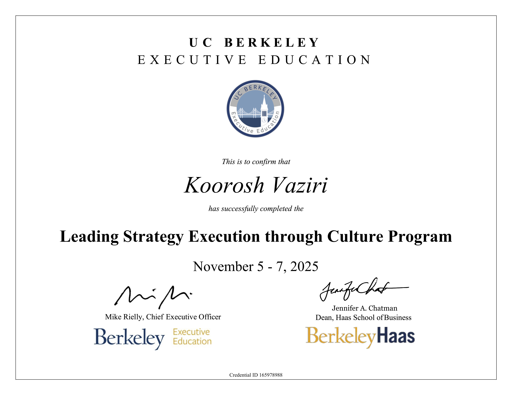

# Leading Strategy Execution through Culture

This repository documents my completion of the **UC Berkeley Executive Education Leading Strategy Execution through Culture program**. The curriculum provides research-based tools to align organizational culture with strategic objectives to drive performance and innovation.

## 🏛️ Strategic Frameworks & Competencies
The program centers on leveraging culture as a "strategy execution engine" rather than a set of secondary perks. Key areas of focus included:

* **Visionary Leadership:** Developing a unique leadership style to capture and communicate a transformational vision that mobilizes teams.
* **Organizational Diagnosis:** Identifying critical gaps between current and ideal cultures to overcome barriers to strategic change.
* **Strategic Alignment:** Ensuring cultural values (e.g., accountability, innovation, and risk-taking) directly support specific business model goals.
* **High-Performance Execution:** Employing culture as a tool to inspire commitment and accelerate team performance toward ambitious organizational targets.

## 💼 Industry Application (Genius Sports)
During the program, I applied these leadership frameworks to real-world strategic challenges within **Genius Sports**. 

* **Note:** Due to the proprietary nature of these organizational strategy documents and cultural assessments, the specific project deliverables remain confidential.

---

*UC Berkeley Professional Certificate: Leading Strategy Execution through Culture*
